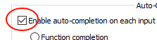
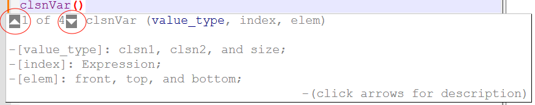
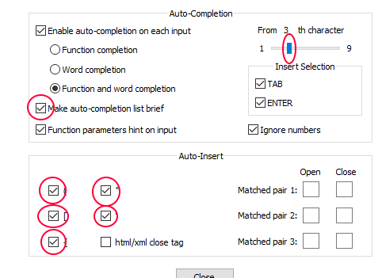

# Auto Completion
## Installation
1. Open Notepad++'s folder, and then locate "autoCompletion" folder.

2. Copy "zss.xml" to that folder.

3. Restart Notepad++.


### To Activate Autocompletion
1. Go to "Settings>Preferences>Auto-Completion", Enable 'auto-completion' on each input.



## Usage
1. Press ```ctrl+shift+space``` to open function tips.(after you put "()" ) or press ```ctrl+space```

2. Press ```Alt+Up/Down``` to scrown between tips and examples;



##### Quality of life tips (optional)

1. Mark "Make auto-completion list brief".
2. Mark "Function and word completion".
3. Mark () [] {} and "" .
4. Mark "Insert slection: TAB, ENTER".
5. Move the bar, from the 1st to 2nd or 3rd character".



