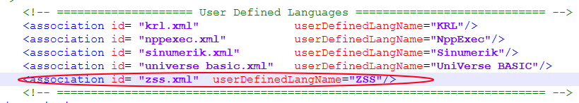
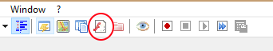
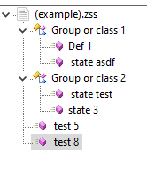

## Installation
1. Open Notepad++'s folder, and then locate "functionList" folder.

2. Copy zss.xml to that folder.

3. Now, in that same folder, locate a file named "overrideMap.xml", then open it.

4. Now find the line: 
"```<!-- ==================== User Defined Languages ============================ -->```"

5. Add the following line:

```<association id= "zss.xml"	userDefinedLangName="ZSS"/>```



6. Restart Notepad++.


### Show Function List

1. "View>Function List" or Press the "f" button on the toolbar.



2. You can test if it worked with the file included: "(example).zss".

It should look like this:



## Usage
* #### #-> 		to declare a function
   #
* #### #<<  		to open a class
* #### #>> 		to close a class
