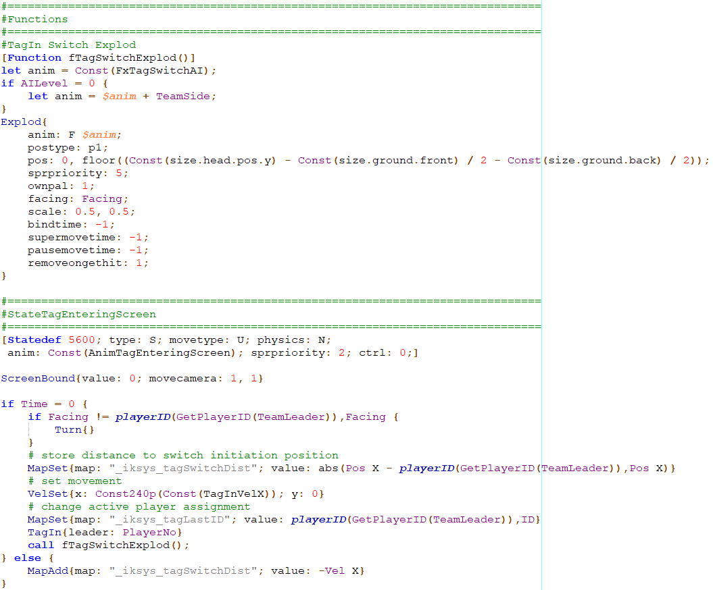

# ZSS (Zantei State Script) syntax highlighting for Notepad++
***
This is a set of tools for writing ZSS(Zantei State Script) using Notepad++. This pack contains a set of 4 tools.

```Note: You Have to update your current ZSS Syntax for all the tools to work properly.```



## Contents
* ZSS Syntax highlighting.
* ZSS Auto-Completion.
* ZSS SCTRL Snippets.
* ZSS Function List (useful for organizing, and navigating through your code).
* ZSS Lexer (Expands on NPP's UDL limitations)

## Installing
Each folder contains a tool, and a set of instructions on how to install it, and use it.


### ZSS Syntax
* The ZSS Syntax UDL for Notepad++.

[ZSS Syntax Update/Installation](ZSS%20Syntax/instructions.md)

### ZSS Auto-Completion.
* A set of auto-completion keywords and functions, mainly aimed to cover Triggers.

[ZSS Auto-Completion Installation](Auto%20Completion/Instructions.md)

### ZSS SCTRL Snippets.
* A set of snippets, mainly aimed to cover 'State Controllers', with a few more inclusions.

[ZSS SCTRL Snippets Installation](Snippets/instructions.md)

### ZSS Function List.
* Notepad++ offers a tab called "Function List". With that tab, you can navigate through functions and classes. The purpose
is to provide a similar way to navigate through your states just like Fighter Factory's "State Explorer".
There is a certain flexibility on how you can parse these functions and classes.
Therefore, you have complete freedom to organize your states, and group them, using "Functions" and "Classes".
It is extremely easy to use, and customize.

[ZSS Function List Installation](Function%20List/Instructions.md)

### ZSS Lexer (New)
* Using Ekopocalypse's "enhanceanylexer plug-in" we can expand on notepad++'s UDL limitations, And create custom lexers for some ZSS triggers, and functions
Current Features:
- Enhance maps, consts, localvars , some triggers such as hitdefattr etc... (Will be expanded in the future)
- Fake-linting, by coloring some "Syntax Errors". Notice: Only some sytax errors are currently implemented, It might me expanded with time in the future. Suggestions are welcome,
but it won't be possible to cover every-single-edge-case scenario, due to both NPP's and the Plug-in's limitations.
currently we have, ";" check for stcrls/localvars, invalid redirections, invalid map names... More will come with time. Suggestions are welcome, if possible they'll be implemented.

[ZSS Lexer Installation](ZSS%20Lexer/instructions.md)


