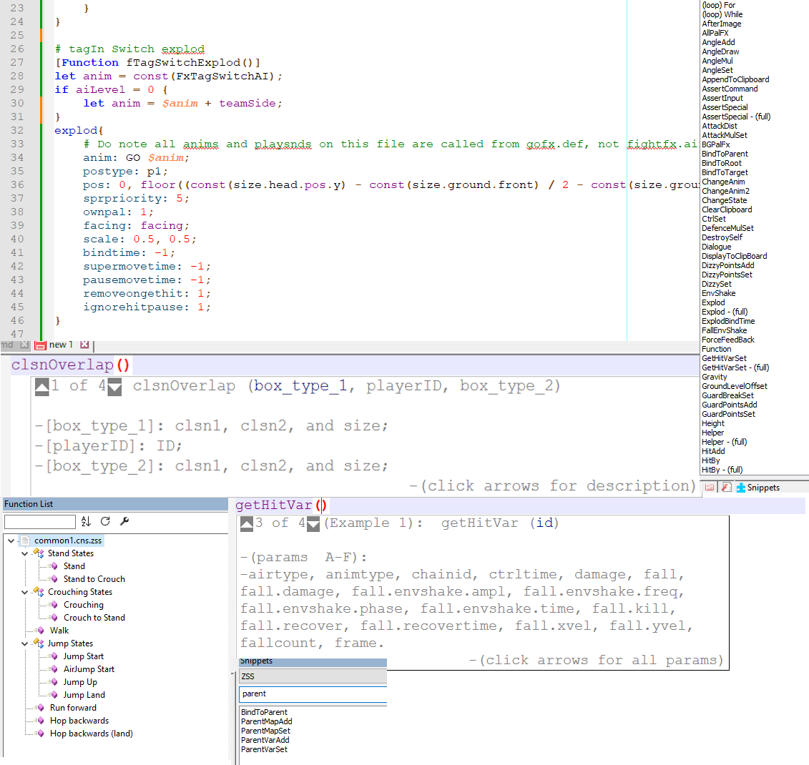

# ZSS (Zantei State Script) syntax highlighting for Notepad++
***

Notepad++ can syntax highlight files with the .zss extension using this user-defined language, within its limits.

## Installing

After downloading the XML file, follow the steps described below:

1. Open Notepad++.
2. Click on the "Language" drop-down menu and select "Define Your Language", and a new window will open.
3. Click the "Import" button and navigate to the location where you downloaded the XML file. A pop-up should now confirm the import was successful.
4. Above the "Import" button, click on the drop-down "User Defined Language" field and select "Choicescript".
5. Close the window and exit Notepad++.
6. Open Notepad++ once again, go back to the "Language" menu, and at the bottom between "Define Your Language" and "User-Defined" you should find "ZSS". Select it and your code should automatically be highlighted.
