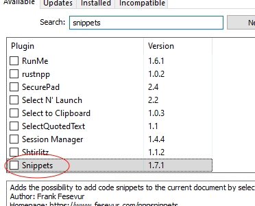
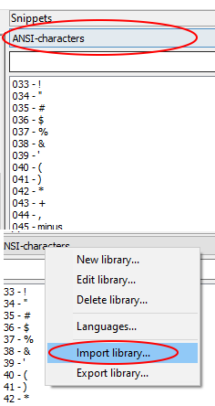
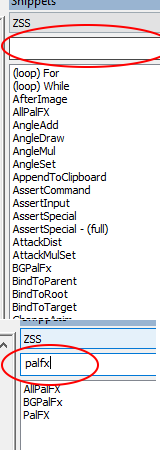
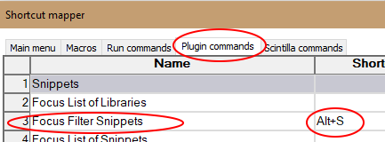

## Plugin Installation
(Note): if your using the portable version of notepad++, sometimes, the plugin admin does not work properly.
if that's your case the try opening plugins folder, and copying the plugin there.

1. Open Plugins Admin: "Plugins>Plugin Admin".

2. Search for snippets. Then install snippets plugin.

3. Restart Notepad++.

#### If the Plugin Admin doesn't work...

1. "Plugins>Open Plugins Folder"

2. Unzip "NppSnippets 1.7". Then insert the "NppSnippets" folder, inside Notepad++'s plugin folder.

3. Restart Notepad++.

## Importing the ZSS SCTRL Snippets

1. After the plugin was successfully installed, open the snippets tab: "Plugins>Snippets>Snippets".

2. Right click the library tab (where it says "ANSI-characters / teamplates"). Then select "import library", 
then import "ZSS Sctrl.sqlite".

### Quality Of Life Tips(optional)
1. You can search for snippets on the tab.

2. you can also define a keyboard shortcut for searching: ("Settings>Shortcut mapper>Plugins commands")

