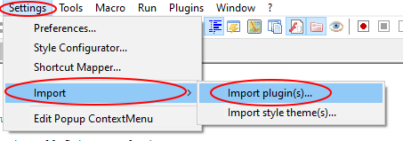
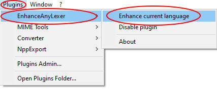
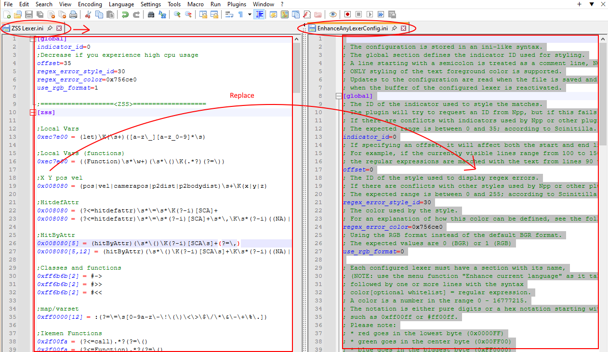
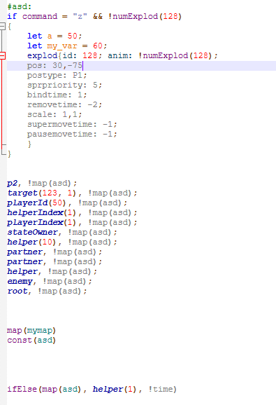
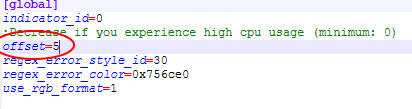

# ZSS Lexer

## Plugin Installation

1. Unzip ```EnhanceAnyLexer_x64.zip```. (You can also visit the offical "Ekopocalypse's" github page, and download the latest version: [EnhanceAnyLexer GithubPage](https://github.com/Ekopalypse/EnhanceAnyLexer/))

2. Then inside Notepad++, go to ```"Settings>Import>Import Plugin"``` and import your unzipped file.



3. Restart Notepad++.

## Adding ZSS Lexer

1. Now, after restarting Notepad++, ```open ZSS Lexer.ini```

2. Now, with your ```ZSS Lexer.ini``` file open, go to```"Plugins>EnhanceAnyLexer>Enhance Current Language"``` A file called ```EnhanceAnyLexerConfig.ini``` will open. 



3. Now, replace ALL contents inside ```EnhanceAnyLexerConfig.ini``` with your ```ZSS Lexer.ini```, Then save the your ```EnhanceAnyLexerConfig.ini```.



If done correctly the lexer should already be working.




### Tips and QOL (Optional)

1. If you experience High CPU usage at some point, you decrease the "offset" vairable inside "global settings" in the "EnhanceAnyLexerConfig.ini".


2. If you find troublesome mistakes you can disable the "Lexer" on the plugin settings, and enable it whenever you want. While you wait for an update to fix the mistkes.
