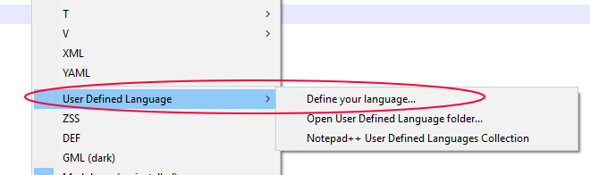
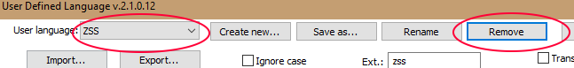

# ZSS Syntax
## Installation
1. Open UDL Dialog: ```"Language>User Defined Language>Define Your Language"```.

2. Click "import", and load the ```"zss.xml"``` file.
	


3. Restart Notepad++.

## Updating
1. Delete your current version of ZSS: ```"Language>User Defined Language>Define Your Language"```


2. Now load the new file. This will prevent conflicts between importing, and file association.

3. Restart Notepad++.


